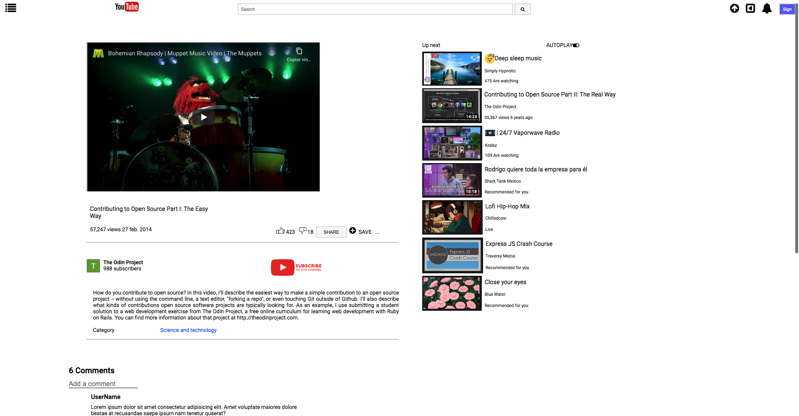

# Embedding-images-and-video

> A youtube clone

In this project we are recreating a website with a simmilar interface to Youtube's

## Built With

- HTML5 & CSS3
- Basic CSS
- Fontawesome

## Live Demo

[You can access to it by clicking on this link](https://sunnysparks.github.io/embedding-images-and-video/)

## Authors

👤 **José Francisco Silva Díaz**

- Github: [@SunnySparks](https://github.com/SunnySparks)
- Twitter: [@JosFranT6](https://twitter.com/JosFranT6)
- Linkedin: [linkedin](https://www.linkedin.com/in/josé-francisco-silva-díaz-a2a9421a6)

👤 **Pablo Alexis Zambrano Coral**

- Github: [@Alexoid1](https://github.com/Alexoid1)
- Twitter: [@pablo_acz](https://twitter.com/pablo_acz)
- Linkedin: [linkedin](https://www.linkedin.com/in/pablo-alexis-zambrano-coral-7a614a189/)

## 🤝 Contributing

Contributions, issues and feature requests and any type of feedback to improve are welcome!

## Show your support

Give a ⭐️ if you like this project!

## Acknowledgments

- The usage of flexbox on CSS
- Better understanding on how to use ids and classes
- awareness of the importance of using semantic  tags

## 📝 License

This project has no license.
